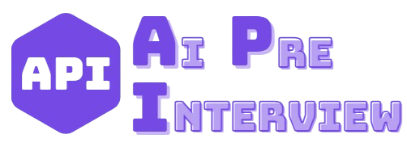
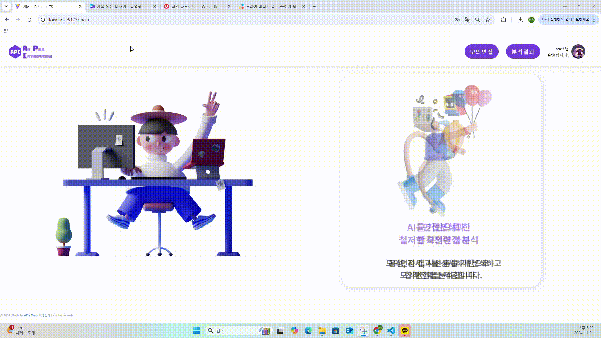
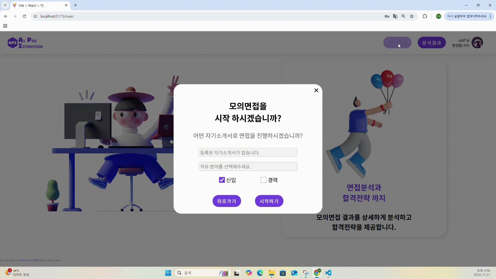
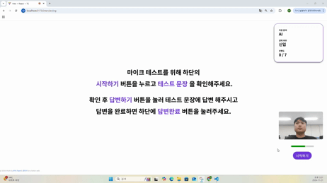
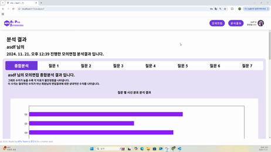

# AI/웹 프로젝트

<!-- 필수 항목 -->

## 카테고리

| Application                          | Domain                                | Language                         | Framework                            |
| ------------------------------------ | ------------------------------------- | -------------------------------- | ------------------------------------ |
| :white_check_mark: Desktop Web       | :white_check_mark: AI                 | :black_square_button: JavaScript | :black_square_button: Vue.js         |
| :black_square_button: Mobile Web     | :black_square_button: Big Data        | :white_check_mark: TypeScript    | :white_check_mark: React             |
| :black_square_button: Responsive Web | :black_square_button: Blockchain      | :black_square_button: C/C++      | :black_square_button: Angular        |
| :black_square_button: Android App    | :black_square_button: IoT             | :black_square_button: C#         | :black_square_button: Node.js        |
| :black_square_button: iOS App        | :black_square_button: AR/VR/Metaverse | :white_check_mark: ​Python        | :white_check_mark: Django            |
| :black_square_button: Desktop App    | :black_square_button: Game            | :black_square_button: Java       | :black_square_button: Spring/Springboot |

# 프로젝트

    
     
    SUPER AI 면접 도우미  

 
 

# 목차

- [팀원 소개](#참여-인원) 
- [개요](#개요) 
- [주요 기능](#주요-기능) 
- [서비스 화면](#서비스-화면) 
- [시스템 아키텍처](#시스템-아키텍처) 
- [주요 기술](#주요-기술) 
- [프로젝트 산출물](#프로젝트-산출물) 

 
 

# 참여 인원

|    박윤찬    | 김민욱 | 김은성 |    김한솔    |   임찬호    |
| :----------: | :----: | :----: | :----------: | :---------: |
|    팀장      | 팀원  | 팀원  | 팀원 | 팀원 |

 
 

# 개요

    - 취업하려면 면접은 거의 필수적이고 AI 면접 또한 대두되고 있다.
    - 면접을 잘보려면 연습이 필요하고, 면접관들은 지원자들의 첫인상이 기억에 남을 수 밖에 없다.
    - 시선, 태도, 목소리 등의 첫인상을 연습해보기 위한 취준생들의 면접 도우미 서비스

 
 

# 주요 기능

### 자소서 기반 질문 생성

    - LLM + RAG를 이용하여 자소서 기반 면접 질문을 생성

### 모의면접 진행

    - 생성된 질문을 기반으로 모의 면접을 진행
    - 면접을 진행하면서 면접 영상 기록

### 모의면접 분석

    - MediaPipe를 이용한 면접 진행 중 시선 분포, 자세 분포 측정
    - voice algorithm을 이용하여 목소리 떨림 분석
    - CNN 모델을 이용한 표정 감정 분석
    - LLM + RAG를 이용하여 답변에 대한 꼬리질문 생성
    
 
 

# 서비스 화면

## 로그인, 회원가입

|  |
| :--------------------------: |
|            로그인            |

## 메인화면

|  |
| :--------------------------------: |
|               메인화면               |

## 자기소개서 등록

|  |
| :-------------------------------: |
|            자기소개서 등록         |

## 모의면접

| .gif) |
| :------------------------------------------: |
|               모의면접(질문생성)             |

|  |
| :------------------------------------------: |
|           모의면접(진행)           |

## 면접결과

|  |
| :------------------------------: |
|             분석결과             |

 
 

# 시스템 아키텍처

# 주요 기술

#### 1. FE

- React

- Typescript

#### 2. BE

- Django

#### 3. DB

- sqlite3

#### 5. AI

- 학습 환경 : Colab, WSL, Ubuntu22.04, Python 3.8.10

- Library : Keras 2.13.1, Tensorflow 2.13.0, torch 2.4.1

- Model : MediaPipe, CNN, Voice Algorithm, LLM + RAG

- 데이터셋 : AI Hub, Roboflow, JOBKOREA/LINKareer Crawling

#### 6. 협업툴

- 커뮤니케이션 : Notion

- 디자인 : Figma

 
 

# 프로젝트 산출물

- [ERD](https://www.erdcloud.com/d/weJ5v5fjATXqdJz9v)
- [와이어프레임(피그마)](https://www.figma.com/design/GcQs3M7RUDOgf5eHmETCvH/API?node-id=0-1&node-type=canvas&t=7GXoDviRoZbrQrks-0)
